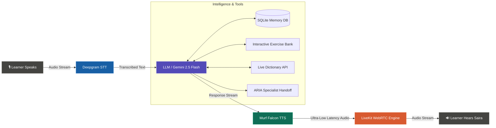

# Saira — AI Learning & Literacy Voice Agent for Bharat 🇮🇳

[](https://opensource.org/licenses/MIT)
[](https://murf.ai/api/docs/text-to-speech/streaming)
[](https://docs.livekit.io)
[](https://deepgram.com)
[](https://nextjs.org/)
[](https://www.python.org/)

**Saira** is an intelligent, empathetic, real-time AI Learning & Literacy Voice Assistant built for Indian students and learners across Bharat. Powered by **Murf Falcon TTS** (the fastest streaming voice AI engine) and **LiveKit WebRTC**, Saira delivers ultra-low-latency, natural, conversational tutoring with Indian voice nuances.

Developed during the **10 Days of Voice Agents — #VoiceForBharat Edition** challenge.

---

## 🌟 Why Saira & Why Voice for Bharat?

In India, over 250 million students learn in multilingual environments. Many lack access to personalized 1-on-1 tutoring or feel intimidated asking questions in class. Saira bridges this gap through voice:

- **Natural Indian English & Hinglish Speech:** Uses Murf Falcon's *Pooja* voice with natural Indian accent intonation and conversational cadence.
- **Supportive Pedagogy:** Instead of immediately giving direct answers, Saira guides learners with hints, explanations, and positive encouragement.
- **Multimodal State Awareness:** Real-time visual indicators showing *listening*, *thinking*, and *speaking* states.
- **Specialist Agent Handoff:** Seamlessly transfers students to **ARIA** (Mathematics Practice Specialist) when math calculations or algebra problems arise.
- **Persistent Learner Memory:** Remembers returning students, past topics covered, and difficulty levels across sessions.
- **Safety & Human Escalation:** Automatically identifies distress or high-complexity queries to escalate to human educators.

---

## 🏗️ Architecture



---

## ⚡ Features Built Across the 10 Days

| Day | Feature | Description |
| :--- | :--- | :--- |
| **Day 1** | **Ultra-Fast Voice Pipeline** | Low-latency WebRTC streaming with Murf Falcon TTS and Deepgram STT. |
| **Day 2** | **Saira Persona & Guardrails** | Educational prompt design, supportive tone, and strict safety guardrails. |
| **Day 3** | **Interactive Frontend UI** | Next.js avatar visualizer with real-time state badge (Listening / Thinking / Speaking). |
| **Day 4** | **Learner Memory & Profiles** | SQLite-backed persistent memory storing past learning topics, levels, and mistakes. |
| **Day 5** | **Real-Time Function Tools** | Live dictionary lookups (`lookup_word_definition`) and quiz generation (`fetch_next_exercise`). |
| **Day 6** | **Telephony & Outbound Calls** | SIP trunking integration for mobile phone connectivity and automated check-in calls. |
| **Day 7** | **Human Teacher Escalation** | Consent-driven escalation system logging tickets for human teachers. |
| **Day 8** | **Call Analytics Dashboard** | Administrative dashboard tracking call metrics, durations, and outcomes. |
| **Day 9** | **Specialist Agent Handoff** | Context-preserving handoff from Saira to **ARIA** for Mathematics Practice. |
| **Day 10** | **Public Showcase & Sharing** | Full open-source release, architecture guide, and blog tutorial. |

---

## 🚀 Quickstart Guide

### Prerequisites

- **Python 3.10+** & **[uv](https://docs.astral.sh/uv/)**
- **Node.js 18+** & **pnpm** (`npm install -g pnpm`)
- API Keys for **LiveKit Cloud**, **Murf AI**, **Deepgram**, and **Google Gemini** (or OpenAI)

### 1. Clone the Repository

```bash
git clone https://github.com/<your-username>/murf-livekit-starter.git
cd murf-livekit-starter
```

### 2. Environment Setup

Create `.env.local` in both `backend/` and `frontend/`:

**`backend/.env.local`:**
```env
LIVEKIT_URL=wss://your-project.livekit.cloud
LIVEKIT_API_KEY=your_livekit_api_key
LIVEKIT_API_SECRET=your_livekit_api_secret
MURF_API_KEY=your_murf_falcon_api_key
DEEPGRAM_API_KEY=your_deepgram_api_key
GOOGLE_API_KEY=your_gemini_api_key
```

**`frontend/.env.local`:**
```env
LIVEKIT_URL=wss://your-project.livekit.cloud
LIVEKIT_API_KEY=your_livekit_api_key
LIVEKIT_API_SECRET=your_livekit_api_secret
```

### 3. Install Dependencies

```bash
# Backend dependencies
cd backend
uv sync
uv run python src/agent.py download-files
cd ..

# Frontend dependencies
cd frontend
pnpm install
cd ..
```

### 4. Run Locally

**Option A — All-in-One script:**
```powershell
# Windows (PowerShell)
.\start_app.ps1

# macOS / Linux
chmod +x start_app.sh
./start_app.sh
```

**Option B — Run in separate terminals:**
```bash
# Terminal 1: Backend Agent
cd backend
uv run python src/agent.py dev

# Terminal 2: Frontend Web App
cd frontend
pnpm dev
```

Open **[http://localhost:3000](http://localhost:3000)**, allow microphone access, and start speaking with Saira!

---

## 🛠️ Domain Tools & Capabilities

- **`lookup_word_definition(word)`**: Fetches real-time phonetic pronunciations, parts of speech, and definitions from the Free Dictionary API with graceful offline fallbacks.
- **`fetch_next_exercise(topic, difficulty)`**: Delivers structured literacy and language exercises categorized by difficulty.
- **`score_spoken_answer(spoken_answer, target_concept)`**: Scores learner responses (0–10) and provides supportive verbal coaching.
- **`lookup_caller(user_id_or_name)` & `save_caller_info(...)`**: Retrieves and updates persistent learning profiles in the database.
- **`create_escalation(reason, summary)`**: Generates an escalation ticket for human teacher review.
- **`transfer_to_aria()`**: Hands off the conversation to ARIA for mathematics instruction while preserving session history.

---

## 📊 Analytics Dashboard

Visit `http://localhost:3000/dashboard` to inspect:
- Total sessions and average call durations
- Learner progress and completed exercises
- Handoff logs (Saira ➔ ARIA)
- Human escalation queue with full conversational context

---

## 📜 License

This project is licensed under the [MIT License](LICENSE).

---

*Built with ❤️ for the **10 Days of Voice Agents — #VoiceForBharat Edition** by [Murf AI](https://murf.ai).*
